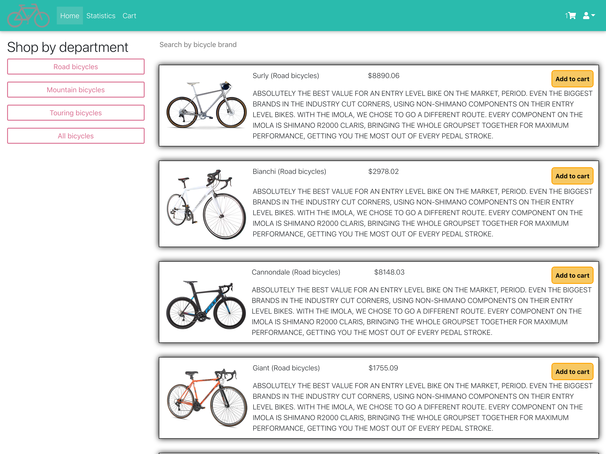
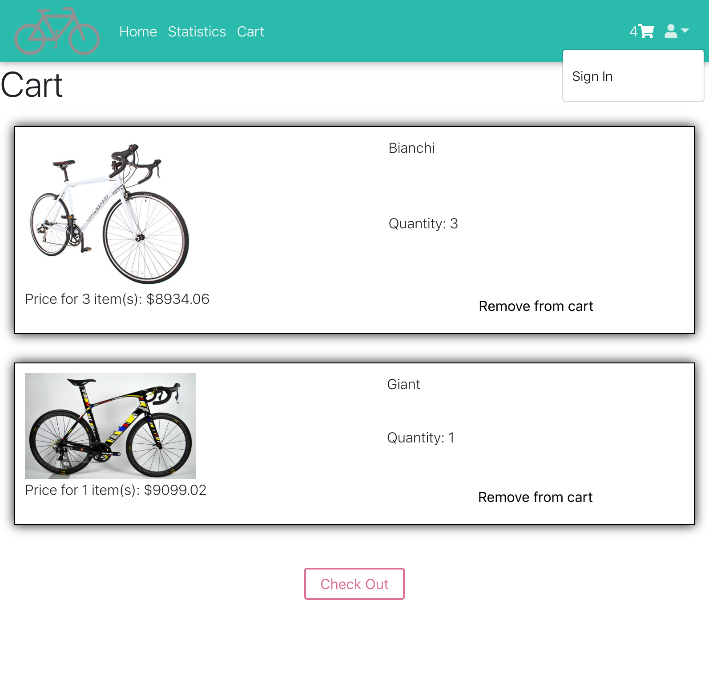
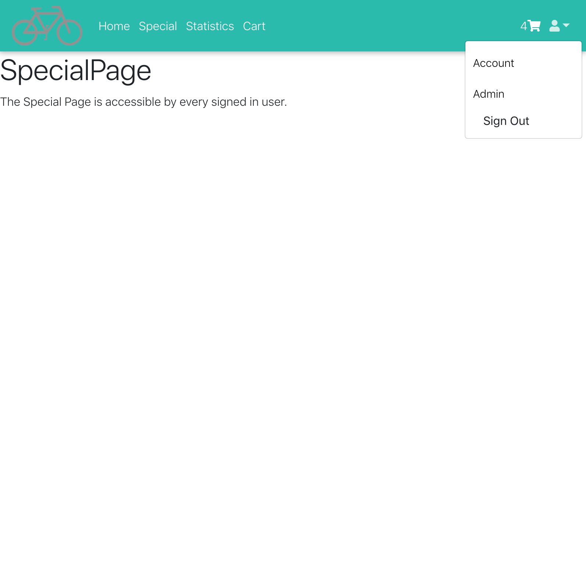
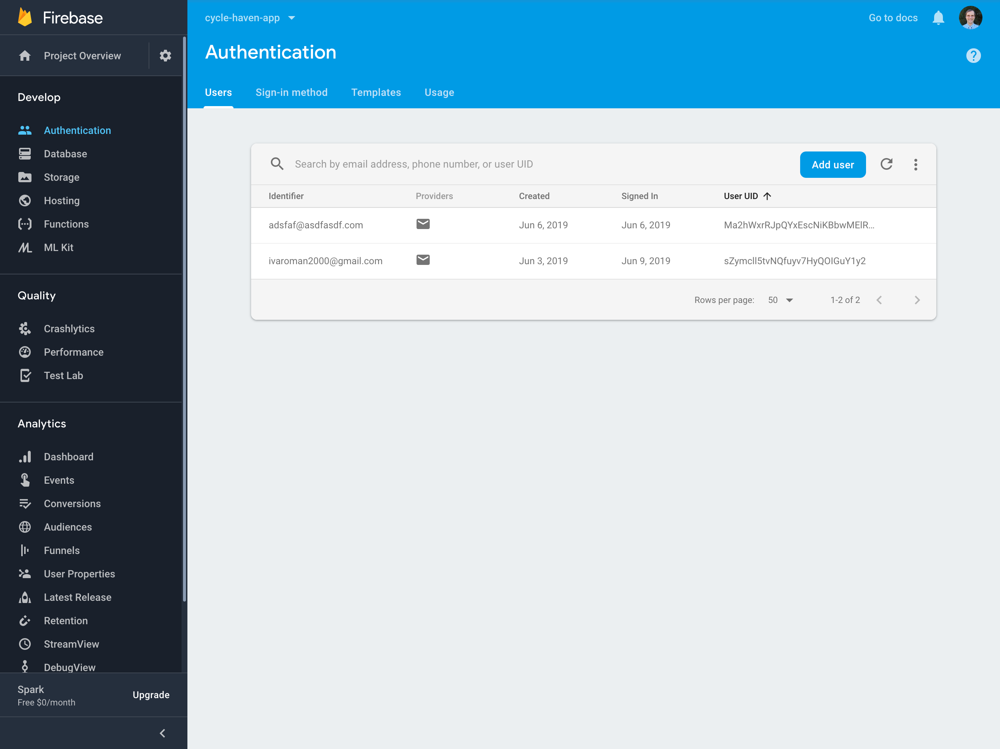
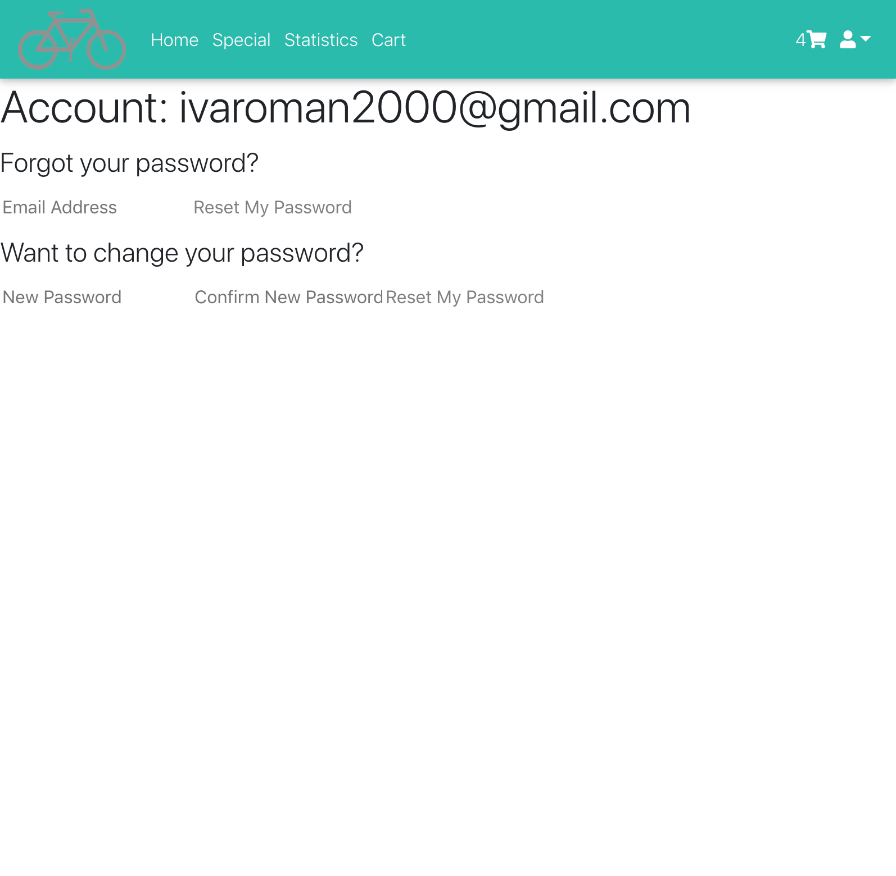
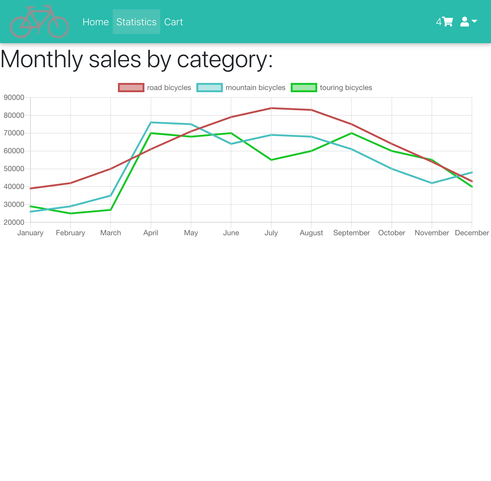

# Cycle Heaven

# Link to Cycle Heaven app: [Cycle Heaven](https://cycle-heaven.herokuapp.com/)

## Front End Overview

Cycle Heaven [Back End Overview](https://github.com/RomanBogatikov/cycle_heaven_app_api)

Cycle Heaven is an online store for selling bicycles.

### Technologies Used:

* ReactJS (including advanced features like: Context, Session Handling with Higher Order Components, Protected Routes with Authorization, Code Splitting)
* Styled Components (for the red buttons that filter bicycles by category)
* Material Design for Bootstrap (React version) to style navigation bar
* ChartJS (to visualize the sales dynamic)
* Scalable Vector Graphics (made a picture of a loading ring in the form of a bicycle wheel)
* @keyframes animations
* Promises chaining (to display loading ring while fetching bicycles from the PostreSQL database)
* LocalStorage (to save user cart if the window is closed)

## Back End Overview
### Technologies Used:

* Ruby on Rails to set up routes
* Firebase to manage users (authenticate, authorize, store sensitive information)
* PostgreSQL to store products (set up many-to-many relationship between all available bicycles and bicycles in each user's cart)

## User stories:

* The user sees a loading ring (in the form of a bicycle ring) when the bicycles are fetched from the database

* Landing page displays a list of bicycles for sale. The user can filter bicycles by category (mountain, road, touring) and by brand (search bar)

* Every user can put items in a cart. The cart persists (is stored in localStorage). There is an option for users to sign in.

* Signed in users have access to a special page (protected route). The user stays signed in when the window is closed.

* Users are managed in Firebase

* Users can manage their account: change password, receive an email with a link to change password

* There is a chart demonstrating sales dynamic

